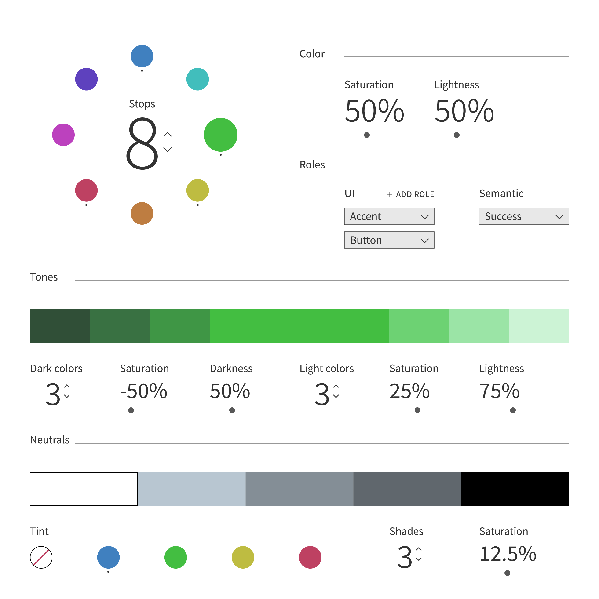

# CSS Primer

Primer is a tool that helps users quickly scaffold a design system. It adds a layer of abstraction on top of CSS so you can make practical, aesthetically-motivated decisions in a graphical environment while outputting clean, semantic code. It also provides single-file configuration for those who don’t want to use the GUI.

The principal abstraction is that every style should serve a role in the design system. That way you don’t create any superfluous styles, and you are encouraged to think about the interplay of styles for different elements.

The way you present your work will determine how people will engage with it. So Primer is designed to meet the needs of any type of website, from elegant typographic sites to unconventional brutalist pieces.

## Typography

On a site in which the majority of the content will be running text, typography should be the first consideration of the design. Primer follows all of the best practices for using type on the web, from enabling kerning to using relative units. Also included are opinionated defaults for things like horizontal rules (i.e. lines), code blocks, and tables.

Selecting and pairing typefaces is covered extensively in the docs, but here’s the process for assigning fonts in Primer. Users can set custom fonts, or they can use one of the 16 system font stacks I provide, organized by type classification and arranged in order of quality. System fonts are those that come pre-installed on certain devices. We create stacks of them because most system fonts only come on devices from one manufacturer, such as Apple, Microsoft, or Google. CSS has the ability to search through a font stack until it finds a font installed on the current device. This can be a great alternative to loading custom webfonts, since it doesn’t add anything to the website’s file size.
There are four main roles, and the font/font stack is set individually for each. These roles are Text, Headings, Code, and UI elements. The font stacks are used as fallbacks by default, ensuring high-quality typography even if the custom fonts fail to load.

## Sizing

Because type is the central element, we should define the size of other elements on our site in relation to the type. In Primer, the size selected for body text defines the base size, and then all other type and spacers are set in proportion thereto. Type sizes can either use a modular scale, which sets each size using a multiplier on a base size, or by inputting a custom multiplier for each font size. The same process is applied to sizing graphical elements, but with much larger multipliers.

## Color

As a designer, developing color palettes has always been a time consuming process, and the existing tools for automating this process have never been able to fulfill my needs – they either generate a handful of beautiful colors that don’t quite fill the requirements, lacking all the semantic colors or the necessary tones, or a limited but well-crafted palette of a single color and its tones, which you need to thoughtfully combine with several harmonious single-color palettes. 

Primer recognizes the extensive needs for colors in a design system. Colors are assigned by role in one of two categories – UI colors, like for text and buttons, and Semantic colors, like for success notifications or warnings. Each color role is also accompanied by a range of tones – variations of the color with differing levels of lightness and saturation. These can be useful for setting text on a lightly colored background or providing dark outlines for colored buttons, for example.

Selecting all these colors and tones by hand is a lot of work, especially if you don’t know color theory.  So it was a central focus of my project to create a GUI for building color palettes.

### The wheel
On page load, the color wheel is pre-seeded with the above colors. The topmost color is selected by default, and it is defined as the Main color under the Roles section. For this color only, the user can enter an entirely new color value in the Color section on the right. They can either enter a hexadecimal color value (since most branding guidelines for non-designers give hex values), or use a visual interface if their browser supports `<input type=”color”>`.

Using the Stops counter in the center of the color wheel, the user can change how many colors are generated around the wheel (using a function based on the main color’s hue angle). For each generated color, the user will be able to tune its Saturation (i.e. the intensity of the color) and Lightness (i.e. how bright it appears).

Then the user can assign roles to the selected color. The colors are assigned to CSS variables based on the roles they are given. For example, the color selected in the mockup would be assigned to `--color-accent`, `--color-button`, and `--color-success`.

### Tones

With a given color selected, a series of tones will appear below. The user will be able to change the number of light and dark stops, respectively, as well as the deltas for saturation and darkness/lightness over the tonal range. Tones can be used for a variety of different applications, such as hover states, shape outlines, backgrounds, etc.

Based on the role of the selected color, these tones will be assigned to a set of CSS variables. For the example in the mockup, they would be (from left to right):

*	`--color-accent-dark-3`, `--color-accent-dark-2`, `--color-accent-dark-1`
*	`--color-accent-light-1`, `--color-accent-light-2`, `--color-accent-light-1`
*	`--color-button-dark-3`, `--color-button-dark-2`, `--color-button-dark-1`
*	`--color-button-light-1`, `--color-button-light-2`, `--color-button-light-1`
*	`--color-success-dark-3`, `--color-success-dark-2`, `--color-success-dark-1`
*	`--color-success-light-1`, `--color-success-light-2`, `--color-success-light-1`

## Layout

I decided that Primer should not concern itself with layout. It used to be expected that CSS frameworks would provide all the necessary styles to build a complete website, with little accounting for customization – the type sizes and styles would be preset, there would be a set of default colors, and there would be a rigid grid system in place for layouts. While it was fairly simple to change the font or color palette, the sizing and grids were fundamentally baked into the frameworks, and in many cases it made sense to abandon a framework outright, rather than attempt to override the defaults. But developers already have too much on their plates. What resulted was an era defined by design homogeneity. See, for example, “[The Only Bootstrap Page](http://dagusa.com/)” (warning: NSFW language).

To be clear, these frameworks solved a real problem. Web layouts were a mess of tables and floats up into the mid-2010s, and achieving anything remotely complex required the hackiest hacks that Stack Overflow could offer. To make matters worse, browser rendering engines were wildly inconsistent in how they treated these elements. Frameworks provided stability, consistency, and predictability while the web had yet to mature.

Today, however, the landscape is very different. CSS grid and flexbox – two new, native web layout modules with extensive support in modern browsers – make it easy to develop complex layouts. So, rather than trying to provide unnecessary abstraction or otherwise reinvent the wheel, I’m deferring layout entirely to the user.

## Todos

- [ ] Finish writing docs
- [ ] Bring docs theme to feature parity with default VuePress theme
- [ ] Color GUI bugfixes
- [ ] Add option to color GUI to export via query params
- [ ] Switch to a perceptual color space (using Chroma.js?)
- [ ] Add print styles

## License

You have my permission to use CSS Primer in whatever projects you wish, whether commercial, personal, or otherwise, in whatever way you like. Official license information can be found in [LICENSE](LICENSE.md) (spoiler: it's the MIT License).

The docs are distributed under a Creative Commons Attribution-NonCommercial-ShareAlike 4.0 license. That means you are free:

*	**To Share –** To copy, distribute and transmit the work;
*	**To Adapt –** To remix the work;

Under the following conditions:

*	**Attribution –** You must attribute the work in the manner specified by the author or licensor (but not in any way that suggests that they endorse you or your use of the work);
*	**Noncommercial –** You may not use this work for commercial purposes;
*	**Share-Alike –** If you alter, transform, or build upon this work, you may distribute the resulting work only under the same or similar license to this one;

Any of the above conditions can be waived if you get my permission. More info [here.](https://creativecommons.org/licenses/by-nc-sa/4.0/)